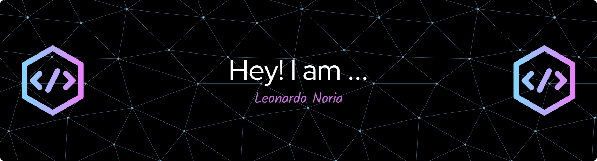

  

-----

<table>
<tr>
 <td align="center" colspan="11"></td>
</tr> 
<tr>
<td>
</td>
<td>
</td>
<td>
</td>
<td>
</td>
<td>
</td>
<td>
</td>
</tr>
<tr>
 <td align="center" colspan="11"></td>
</tr> 
</table>

<i><b>Olá</b> :wave:, sou o <code>Leonardo</code>, tenho 19 anos, moro em Belo Horizonte e iniciei minha jornada de programador aos 18 anos de idade. Atualmente estou <code>cursando</code> Engenharia de Software na <a href="https://www.pucminas.br/" target="_blank">PUC Minas</a>.</i> :man_teacher: 

-----

<!-- Seção sobre mim -->

<h3>🤙​ Sobre mim</h3>

 Olá! Meu nome é Leonardo Noria e sou estudante de Engenharia de Software na PUC Minas.
Desde que iniciei minha jornada na tecnologia, venho me dedicando com afinco ao desenvolvimento de sistemas que sejam funcionais, bem estruturados e que gerem impacto positivo no dia a dia dos usuários.
Possuo conhecimento da lingua ingles como segunda língua

Atualmente estou no 1º período e venho consolidando meus conhecimentos tanto no back-end quanto no front-end, com especial interesse por arquitetura de software, usabilidade e acessibilidade. Minha stack principal envolve Python, HTML, CSS, JavaScript e Bootstrap, além da utilização de ferramentas como VS Code, e GitHub. T

Tenho experiência prática no desenvolvimento de sistemas completos através dos meus trabalhos interdisciplinares e alguns projetos de software

Busco constantemente evoluir, tanto no aspecto prático quanto teórico, por meio de cursos extracurriculares, e exercícios de programação.

-----

<!-- Seção interesses -->

<h3> 🕹️ Meus interesses</h3>

<table>
  <tr>
    <td>
      

Nascido e criado em Minas Gerais, Belo Horizonte cultivo diversas paixões além do mundo da tecnologia. Gosto de aproveitar meu tempo com jogos online alem de  atividades físicas e esportes. Nas horas vagas, também me divirto assistindo filmes e séries e como todo brasileiro tenho uma paixão por futebol e torço para o Cruzeiro Esporte Clube, time que acompanho com orgulho desde a infância.
      

    </td>
  </tr>
</table>

-----

&nbsp;Linguagens e ferramentas:

<code></a></code>
&nbsp;
<code></a></code>
&nbsp; 
<code></a></code>
&nbsp; 
<code></a></code>
&nbsp;
<code></code>
&nbsp;
<code></a></code>
&nbsp;   
<code></a></code>
&nbsp; 
<code></a></code>
&nbsp; 
<code></a></code>
&nbsp;
<code></code>
&nbsp; 
<code></a></code>
&nbsp; 
<code></a></code>
&nbsp; 

-----

 GitHub Stats:

<!--
<table>
<tr>
<td align="center">:octocat: <a href="https://www.githubwrapped.io/norialeo" target="_blank">GitHub Wrapped</a></td>
<td align="center" colspan="2">:watch: <a href="https://wakatime.com/@norialeo">WakaTime</a></td>
</tr> 
<tr>
<td></td>
<td></td>
<td>

</td>
</tr>
</table>
<table>
<tr>
 <td align="center" colspan="3"></td>
</tr> 
<tr>
<td>

</td>
<td>

</td>
<td>

</td>
</tr>
<tr>
 <td align="center" colspan="3"></td>
</tr> 
</table>
--> 
<table>
<tr>
 <td align="center" colspan="2">:watch: <a href="https://wakatime.com/@norialeo">WakaTime</a></td>
</tr> 
<tr>
<td></td>
<td>

</td>
</tr>
</table>
<table>
<tr>
 <td align="center" colspan="3"></td>
</tr> 
<tr>
<td>
<!--  -->

</td>
<td>
<!--  -->

</td>
<td>

</td>
</tr>
<tr>
 <td align="center" colspan="3"></td>
</tr> 
</table>

<table>
<tr>
 <td align="center" colspan="3"></td>
</tr> 
<tr>
<td>
<!-- 
 -->

</td>
<td>

</td>
<td>

</td>
</tr>
<tr>
 <td align="center" colspan="3"></td>
</tr> 
<tr>
<td>

</td>
<td>

</td>
<td>
<!--  -->

</td>
</tr>
<tr>
 <td align="center" colspan="3"></td>
</tr>
</table>

<table>
<tr>
 <td align="center"></td>
</tr>
<tr>
 <td align="center"></td>
</tr>
<tr>
 <td align="center"></td>
</tr> 
</table>

&nbsp;Veja mais

 

<table>
<tr>
 <td align="center" colspan="2">:octocat: GitHub Metrics</td>
</tr>
<tr>
<td>

</td>
<td>

</td>
</tr>
<tr>
<td>

</td>
<td>

</td>
</tr>
<tr>
<td>

</td>
<td>

</td>
</tr>
<tr>
<td>

</td>
<td>

</td>
</tr>
<tr>
 <td align="center" colspan="2"></td>
</tr> 
</table>

<table>
<tr>
 <td align="center">:octocat: GitHub 5-Year Retrospective</td>
</tr>
<tr>
 <td align="center">
  
 </td>
</tr>
</table>

-----

 Leo's Spotify Data

<table>
<tr>
 <td align="center" colspan="3"></td>
</tr> 
<tr>
<td>

</td>
<td>

</td>
<td>
<!--  -->

</td>
</tr>
<tr>
 <td align="center" colspan="3"></td>
</tr> 
</table>

